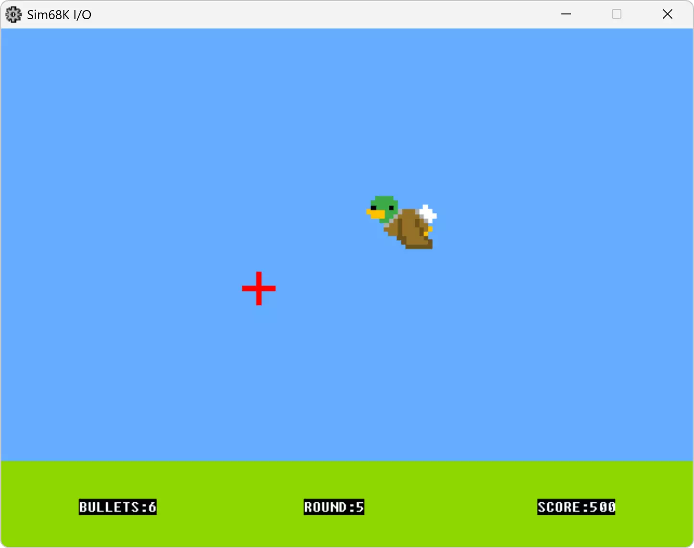

# 68k Assembly Duck Hunt

> .[!NOTE].
> **68k Assembly Duck Hunt** is an unofficial game, very slightly inspired by Nintendo's classic **Duck Hunt** game. This project is developed solely for educational purposes and is not affiliated with or endorsed by Nintendo in any way.

## Table of Contents
1. [Overview](#overview)
2. [Installation & Compilation](#installation--compilation)
3. [Gameplay Instructions](#gameplay-instructions)
4. [License](#license)
5. [Contact](#contact)

### Overview
Welcome to the **68k Assembly Duck Hunt** repository! 🦆🎮

This project was created by 
<a href="https://github.com/AaronTudor-tester" target="_blank">Aaron Tudor</a> 
and 
<a href="https://github.com/miquelsf" target="_blank">Miquel Sansó</a> 
as part of our Computer Engineering studies. Building upon a foundational base provided by our professor, 
<a href="https://github.com/aburguera" target="_blank">Antoni Burguera</a>, 
the game captures the essence of the original while prioritizing educational objectives over full gameplay replication.

Developed entirely in 68k Assembly, this project provides deep insights into low-level programming. We utilized the renowned 
<a href="https://www.easy68k.com/" target="_blank">EASy68k</a> 
simulator to design and implement the game, ensuring a realistic environment for development and testing. Through this endeavor, we have enhanced our understanding of the 68k processor architecture and the intricacies of assembly programming.

Whether you're looking to expand your knowledge of assembly language or explore the fundamentals of processor architecture, the 68k Assembly Duck Hunt project offers a practical and engaging learning experience. Feel free to explore the repository and reach out with any questions! 💡

### Installation & Compilation ⚙️

To install and run the game:

1. Download the simulator 
   <a href="https://www.easy68k.com/" target="_blank">**EASy68k**</a>.
2. Open the file `MAIN.X68` with 
   <a href="https://www.easy68k.com/" target="_blank">EASy68k</a>.
3. Click the **Play** button at the top and then click **Execute**.
4. Go to **Options** and select **Enable Extensions**.
5. Finally, click the last **Play** button at the top.

Here's a 
<a href="https://youtu.be/eGJJY1Rsqjw" target="_blank">**video**</a> 
showing the steps! ▶️

### Gameplay Instructions 🕹️

It's very simple! Just press the **spacebar** to start playing, then aim with the **mouse** and **click** to shoot.

Here's a 
<a href="https://youtu.be/SFCFCO39x4E" target="_blank">**video**</a> 
of the gameplay! ▶️

### License

For educational use only. **Explicit written permission from the authors is required** for any other use.

### Contact ✉️

Feel free to reach out at 
<a href="mailto:miquel98sf@gmail.com" target="_blank">miquel98sf@gmail.com</a> 
if you have any questions!
